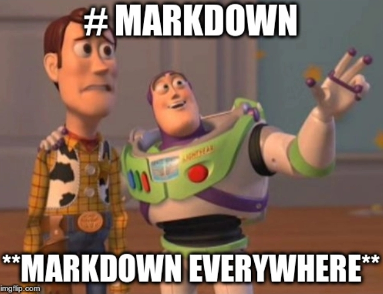

#Langage MarkDown (md)

##C'est quoi ?
Le MarkDown est un langage de balisage (_markup language_) qui permet de produire du texte formaté à partir de fichiers texte.

Très similaire au HTML, le md a été développé par John Gruber en 2004, avec l'objectif de fournir un langage équivalent au HTML mais *lisible en texte brut*. 

Techniquement, le md est traduit vers du HTML lorsqu'il est affiché par un programme qui l'interprète.

##Ça fait quoi ?
En md on peut faire tout ce qu'on fait en HTML : 
* Des listes,
* des titres,
* de l'_italique_,
* du *gras*,
* des [liens hypertexte](https://www.markdownguide.org/)
* du `code`

---

On peut faire des lignes de séparations, voire inclure des images

##Et comment ça marche ?
Les balises sont plus simples qu'en HTML.

Pour les titres, on utilise des `#`. Un pour un titre H1 (ici, le titre de la page), deux pour un titre H2 _etc_.

Le texte en *gras* se place entre des `*`. L'italique entre des `_`.

Pour faire une liste, il suffit de commencer chaque ligne de la liste par `*`.

Les liens hypertexte se font avec la balise `[nom](cible)`

Le code se place entre "backticks" : `` ` ``.

Un trait de séparation se fait avec `---`.

Et puis comme le md est en fait une surcouche sur le HTML, les balises HTML sont reconnues en md. Par exemple l'image au dessus a été incluse avec ``.
